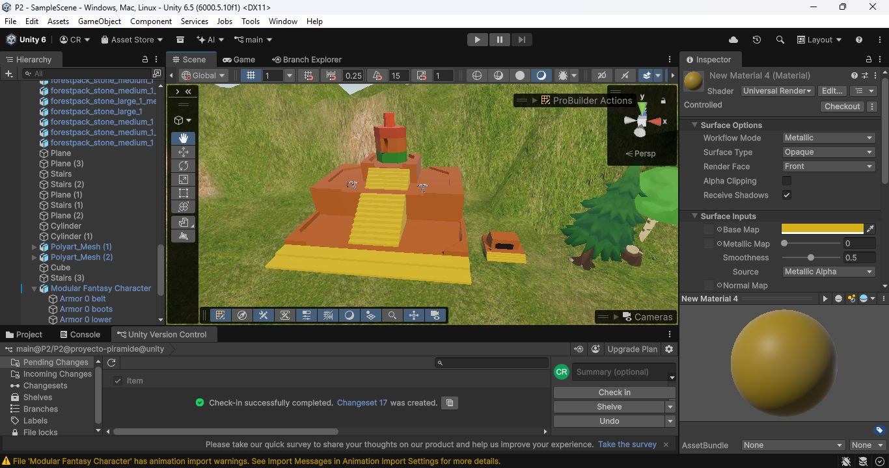
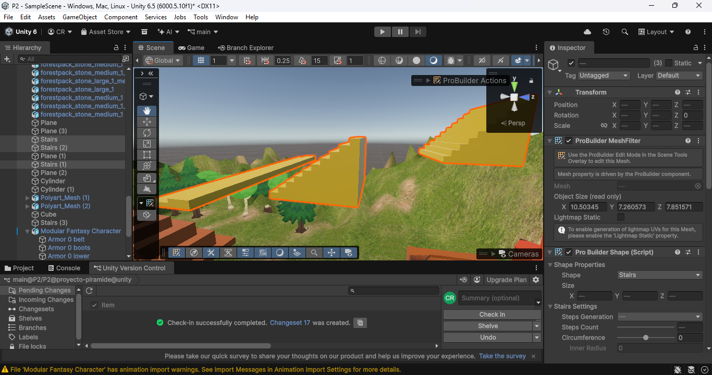
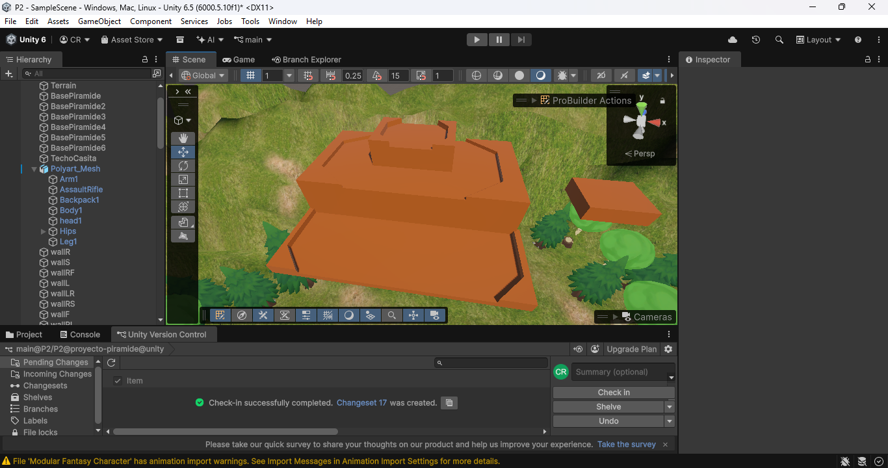
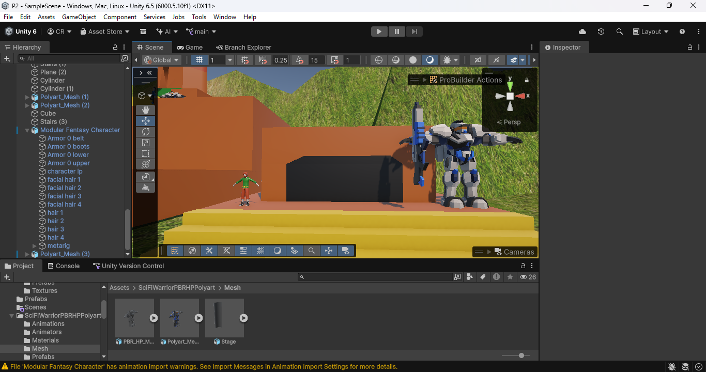

# Proyecto-Piramide

### Pasos seguidos durante la creacion del proyecto con imagenes

Se importa el terreno que se usará para la piramide.

Se modifica el terreno, se añade la posición de la torre y se le añaden las texturas

primera version de la torre se crea con varios planos.

Se crean las escaleras, se copian a todos los otros lados y se crea el material de las escaleras para su color

se crea preset de las escaleras para mayor facilidad de modificacion al modificar la torre.

se crean presets de rocas decorativas para las esquinas de las piedras

se decora con arboles de el envirionment pack gratuito del unity asset store

link de assets: https://assetstore.unity.com/packages/3d/vegetation/environment-pack-free-forest-sample-168396

Creacion del Caracol aproximado

Utilizacion de Probuilder para creacion de assets- Escaleras, Plataformas y Edificios

Humano con Robot

### Historia corta sobre el videojuego hipotetico

Desde un tiempo desconocido, hubo una civilización cuyos residentes son referidos como robots por los habitantes del planeta tierra. Esta civilización es una expansionista, conquistando planetas cuyo les capta el interés. Debido a la grandeza y edad de esta, también se ven facciones en esta, con las que nos interesemos en una, esta será una facción que va en contra del expansionismo de los lideres.

Debido a conflictos violentos, se encontró un escuadrón de robots de esta facción en un valle localizado en centro América. Estos robots, con una disposición mas pasiva a de sus compatriotas, se unieron a manos con los humanos que se encontraron ahí. Con el motivo de tener buenas relaciones con los nativos y poder recuperarse, ayudaron en la creación de edificios como sus grandes pirámides. En unos años estas dos civilizaciones se encuentran con una relación amistosa, pero no se mantendrán justas por siempre.

Debido a la naturaleza de la llegada de estos robots a el planeta los expansionistas se encuentran con el conocimiento de este
planeta, y sus potenciales recursos. Es por eso por lo que está en el interés de los que están en el planeta a recuperarse lo mas temprano posible para que puedan entrar en contacto con su facción libertaria y tal vez proteger el planeta y sus habitantes de se explotados por sus recursos. ¿Podrán cumplir con sus deseos o serán menos que una nota en la historia de la gran civilización de que nacieron?
	

### Pensamientos finales

Pablo: Este proyecto nos ayudó a entender el proceso de creación de un entorno simple en un videojuego. Fue interesante tomar un terreno ya existente y modificarlo para las necesidades del proyecto. La tienda de assets de unity fue interesante de explorar y la variedad que algunos de los gratuitos poseen es increible. Ademas de esto lo  que es posible hacer con assets basicos abre puertas para mucha creatividad.

Christopher: En adicion de entender el proceso de creacion de un entorno, tambien ayudo con la utilizacion de tools para proyectos. En el caso de este, probuilder funciona para la creacion de formas basicas para hacer bases para otros objetos mas complicados. Finalmente este proyecto ejercio pensamiento creativo en mezclar robots con los mayanos.
